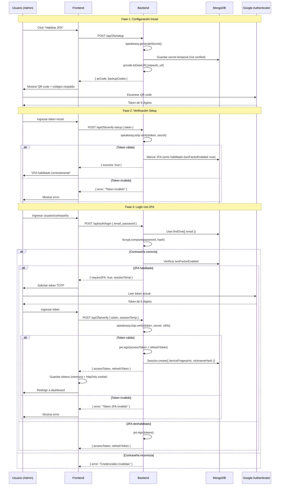
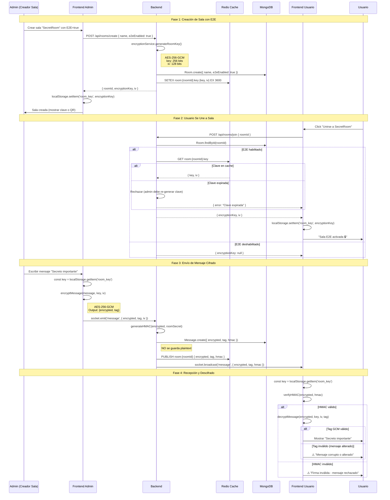
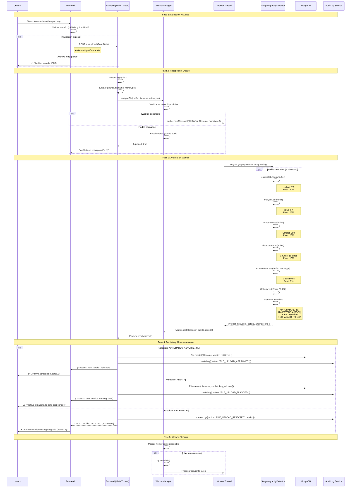
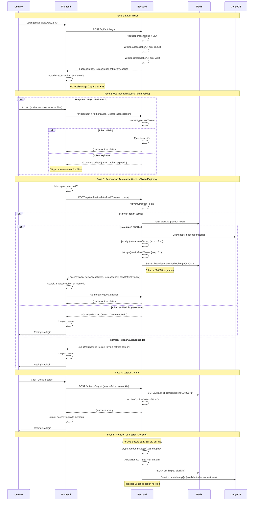
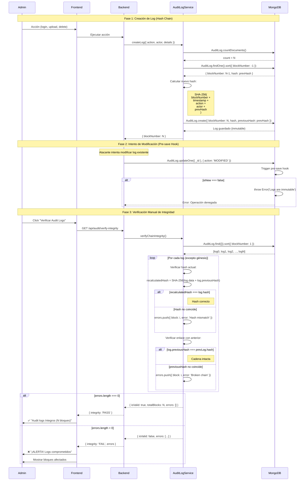

# 📊 Diagramas de Secuencia - Flujos de Seguridad

Este documento contiene los diagramas de secuencia para los principales flujos de seguridad del sistema CHAT 2.0.

---

## 1. Flujo de Autenticación con 2FA

---

## 2. Flujo de Cifrado End-to-End

---

## 3. Flujo de Subida de Archivo con Análisis de Esteganografía

---

## 4. Flujo de Rotación de Tokens JWT

---

## 5. Flujo de Verificación de Integridad de Audit Logs

---

## Notas Técnicas

### Leyenda de Símbolos
- `🔒` Operación cifrada
- `✅` Verificación exitosa
- `❌` Error o rechazo
- `⚠️` Advertencia

### Tiempos Promedio
- **2FA Setup**: ~30 segundos
- **Login con 2FA**: ~10 segundos
- **Cifrado E2E (mensaje)**: <50ms
- **Análisis esteganografía (1MB)**: ~200ms
- **Renovación JWT**: <100ms
- **Verificación audit chain (1000 logs)**: ~500ms

### Dependencias Críticas
- `speakeasy` v2.0.0 (2FA/TOTP)
- `jsonwebtoken` v9.0.2 (JWT)
- Node.js `crypto` module (SHA-256, AES-256-GCM)
- `worker_threads` (procesamiento paralelo)

---

**Última actualización**: Enero 2025  
**Versión**: 2.0
